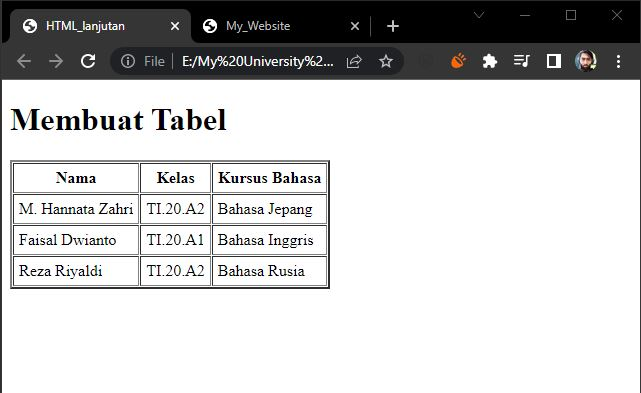
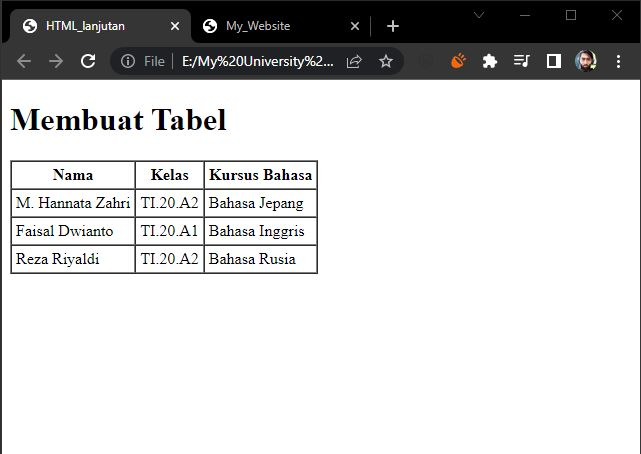

# Tugas Praktikum (pert. 4)

### 1. Membuat Ordered List
```html
<header>
    <h1>Membuat List</h1>
</header>
<section id="order-list">
    <h2>Oredered List</h2>
    <ol>
        <li>Pemrograman Web</li>
        <li>Bisnis Elektronik</li>
        <li>Sistem Basis Data</li>
    </ol>
</section>
```


### 2. Membuat Unordered List
```html
<section id="unorder-list">
    <h2>Unordered List</h2>
        <ul type="square">
            <li>Bahasa Inggris</li>
            <li>Bahasa Jepang</li>
            <li>Bahasa Rusia</li>
        </ul>
</section>
```


### 3. Membuat Description List
```html
<section id="unorder-list">
    <h2>Description List</h2>
    <dl>
        <dt>Fakultas Teknik</dt>
        <dd>Teknik Industri</dd>
        <dd>Teknik Informatika</dd>
        <dd>Teknik Lingkungan</dd>
        <dt>Fakultas Ekonomi dan Bisnis</dt>
        <dd>Akuntansi</dd>
        <dd>Manajemen</dd>
        <dd>Bisnis Digital</dd>
    </dl>
</section>
```


### 4. Membuat Tabel
```html
<header>
    <h1>Membuat Tabel</h1>
</header>
<table border="2" cellpadding="5" cellspacing="1">
    <thead>
        <tr>
            <th>Nama</th>
            <th>Kelas</th>
            <th>Kursus Bahasa</th>
        </tr>
    </thead>
    <tbody>
        <tr>
            <td>M. Hannata Zahri</td>
            <td>TI.20.A2</td>
            <td>Bahasa Jepang</td>
        </tr>
        <tr>
            <td>Faisal Dwianto</td>
            <td>TI.20.A1</td>
            <td>Bahasa Inggris</td>
        </tr>
        <tr>
            <td>Reza Riyaldi</td>
            <td>TI.20.A2</td>
            <td>Bahasa Rusia</td>
        </tr>
    </tbody>
</table>
```


### 5. Mengatur Margin dan Padding
```html
<table border="1" cellpadding="4" cellspacing="0">
```


### 6. Menggabungkan Sel data
```html
<table border="1" cellpadding="4" cellspacing="0">
    <thead>
        <tr>
            <th>Nama</th>
            <th>Kelas</th>
            <th>Kursus Bahasa</th>
        </tr>
    </thead>
    <tbody>
        <tr>
            <td>M. Hannata Zahri</td>
            <td rowspan="3">TI.20.A1 & A2</td>
            <td>Bahasa Jepang</td>
        </tr>
        <tr>
            <td>Faisal Dwianto</td>
            <td>Bahasa Inggris</td>
        </tr>
        <tr>
            <td>Reza Riyaldi</td>
            <td>Bahasa Rusia</td>
        </tr>
    </tbody>
</table>
```


### 7. Membuat Form
```html
<form action="proses.php" method="post">
    <fieldset>
        <legend>Data Player</legend>
        <p>
            <label for="nama">Nama</label>
            <input type="text" id="nama" name="nama">
        </p>
        <p>
            <label for="alamat">Alamat</label>
            <textarea name="alamat" id="alamat" cols="25" rows="5"></textarea>
        </p>
        <p>
            <label for="#">Jenis Kelamin</label>
            <input id="jk_1" type="radio" name="kelamin" value="L"><label for="jk_1">Laki-Laki</label>
            <input id="jk_2" type="radio" name="kelamin" value="P"><label for="jk_2">Perempuan</label>
        </p>
        <p>
            <input type="Submit" value="Login">
        </p>
    </fieldset>
</form>
```


### 8. Menambahkan Style pada Form
```css
<style>
    form p > label{
        display: inline-block;
        width: 100px;
    }
    form input[type="text"], form textarea{
        border: 1px solid rgb(88, 88, 255);
    }
    form input[type="submit"]{
        border: 1px solid rgb(88, 88, 255);
        background-color: rgb(88, 88, 255);
        color: #fff;
        font-weight: bold;
        padding: 5px 55px;
    }
</style>
```
